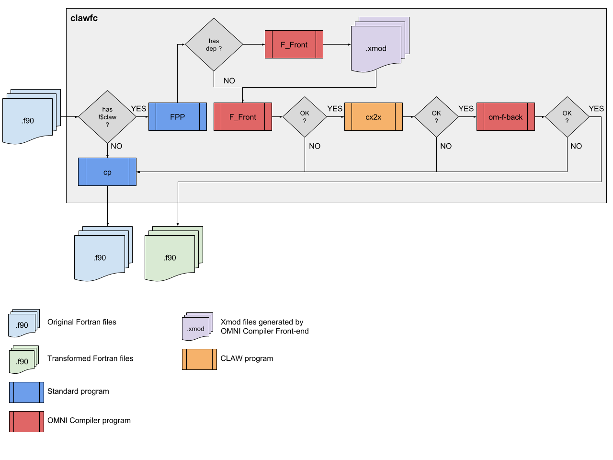
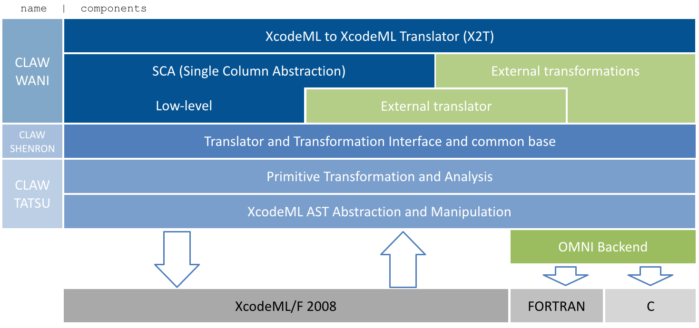

# CLAW FORTRAN Compiler

<a target="_blank" href="http://semver.org"></a> [](https://travis-ci.org/clementval/claw-compiler)
<a target="_blank" href="https://claw-compiler.slack.com/"></a>

<a target="_blank" href="https://github.com/C2SM-RCM/claw-language-specification/blob/master/claw_language_specifications.pdf"></a>


> Who is in charge here?
>
> The CLAW!
>
> The CLAW is our master.
>
> The CLAW chooses who will go and who will stay.
>
> -- <cite>Buzz Lightyear & Two Green Aliens in the UFO Catcher.</cite>


### CLAW Directive language specifications
The directives that control the transformation flow are defined in the
CLAW directive language specification.

[CLAW language definition](https://github.com/C2SM-RCM/claw-language-definition)

### Status of implementation
We are currently implementing the version `v0.3a` of the CLAW language
specification in this reference compiler.

### Compiler workflow
The diagram below shows the workflow of the CLAW Compiler.


##### Key components:
* **FPP**: standard preprocessor.
* **OMNI F_Front**: FORTRAN front-end. Convert FORTRAN source code into an
  intermediate representation (XcodeML/F).
* **CLAWX2T**: CLAW XcodeML to XcodeML translator.
* **OMNI F_Back**: FORTRAN back-end. Generates FORTRAN code from XcodeML/F
  intermediate representation.
* **OMNI C_Back**: C back-end. Generates C code from XcodeML/C
  intermediate representation.

### CLAWX2T Library stack overview



### How to install
See [INSTALL.md](./INSTALL.md) file.

### Documentation
To generate the java documentation and the compiler documentation, run the
following command. The compiler documentation require `pdflatex`.

The compiler documentation is generated in the `/documentation` directory, the
developer's guide is generated in the `/documentation/developer` directory and
the `javadoc` is generated in the `/documentation/javadoc/` directory.

```bash
make doc
```

### Supported version
The CLAW XcodeML to XcodeML translator is written in Java. Java version 7 and
above are supported.


### OMNI Compiler
The CLAW Compiler is built on the top of the OMNI Compiler. For more
information: [OMNI Compiler website](http://omni-compiler.org)
