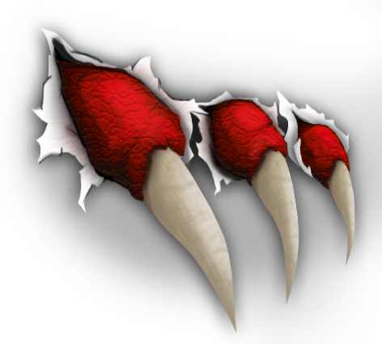

# CLAW Fortran Compiler (omni-cx2x)

The directives that control the transformation flow are defined in the
CLAW language definition.

[CLAW language definition](https://github.com/C2SM-RCM/claw-language-definition)

We are currently implementing the first directives into our own translator.
The current development status is the following (Only limited cases have been
tested).
- [x] loop-fusion
- [x] loop-interchange
- [ ] loop-extract
- [x] remove

For future version
- [ ] loop-vector (on hold in the spec)
- [ ] scalar-replace (out of scope for evaluation)
- [ ] data (out of scope for the moment)
