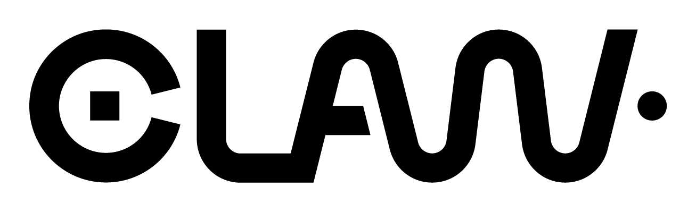

<a target="_blank" href="http://semver.org"></a> [](https://travis-ci.org/claw-project/claw-compiler)
<a target="_blank" href="https://claw-compiler.slack.com/"></a>
<a target="_blank" href="https://claw-project.github.io/"></a>


<a target="_blank" href="https://github.com/claw-project/claw-language-specification/blob/master/claw_language_specifications.pdf"></a>


> Who is in charge here?
>
> The CLAW!
>
> The CLAW is our master.
>
> The CLAW chooses who will go and who will stay.
>
> -- <cite>Buzz Lightyear & Two Green Aliens in the UFO Catcher.</cite>


#### What is the CLAW Compiler?
The CLAW Compiler is a source-to-source translator working on the XcodeML
intermediate representation. It implements the necessary transformation to the
CLAW Directive Language Specifications.
Intent of this language is to achieve performance portability on weather and
climate code, especially for column- or point-wise computation.

#### CLAW Directive Language Specifications
The directives that control the transformation flow are defined in the
[CLAW Directive Language Specification](https://github.com/claw-project/claw-language-specification).

#### Compiler workflow
The diagram below shows the workflow of the CLAW Compiler.


##### Key components:
* **FPP**: standard preprocessor.
* **OMNI F_Front**: Fortran front-end. Convert Fortran source code into an
  intermediate representation (XcodeML/F).
* **CLAWX2T**: CLAW XcodeML to XcodeML translator.
* **OMNI F_Back**: Fortran back-end. Generates Fortran code from XcodeML/F
  intermediate representation.
* **OMNI C_Back**: C back-end. Generates C code from XcodeML/C
  intermediate representation.


#### CLAWX2T Java Library Stack Overview


The CLAW XcodeML to XcodeML translator library stack is divided in three
distinct library:

* CLAW-WANI: CLAW translator implementation with all high-level transformation
  as well as mechanism to plug external translator and transformation.
* CLAW-SHENRON: Define the super classes for any translator or transformation
  implementation.
* CLAW-TATSU: Define the interface between XcodeML IR and the translation
  library. Implements all primitive transformations that serve as higher-level
  transformation building block.


#### How to install
See [INSTALL.md](./INSTALL.md) file.


#### Documentation
To generate the java documentation and the compiler documentation, run the
following command. The compiler documentation require `pdflatex`.

The compiler documentation is generated in the `/documentation` directory, the
developer's guide is generated in the `/documentation/developer` directory and
the `javadoc` is generated in the `/documentation/javadoc/` directory.

```bash
make doc
```

#### Supported version
The CLAW XcodeML to XcodeML translator is written in Java. Java version 7 and
above are supported.


#### OMNI Compiler
The CLAW Compiler is built on the top of the OMNI Compiler. For more
information: [OMNI Compiler website](http://omni-compiler.org)


#### About
This work was initially funded by the ETH zürich, MeteoSwiss and the PASC
initiative under the [ENIAC](http://www.pasc-ch.org/projects/2017-2020/eniac/)
project.

#### Support
The CLAW compiler is currently not actively developed. Issues may be reported in the Github 
issue section but response time is not garanteed.
If you have questions regarding further developments of the CLAW compiler or collaborations
please contact xavier.lapillonne AT meteoswiss.ch or katherine.osterried AT env.ethz.ch .

---
Logo by [adrienbachmann.ch](http://www.adrienbachmann.ch)
